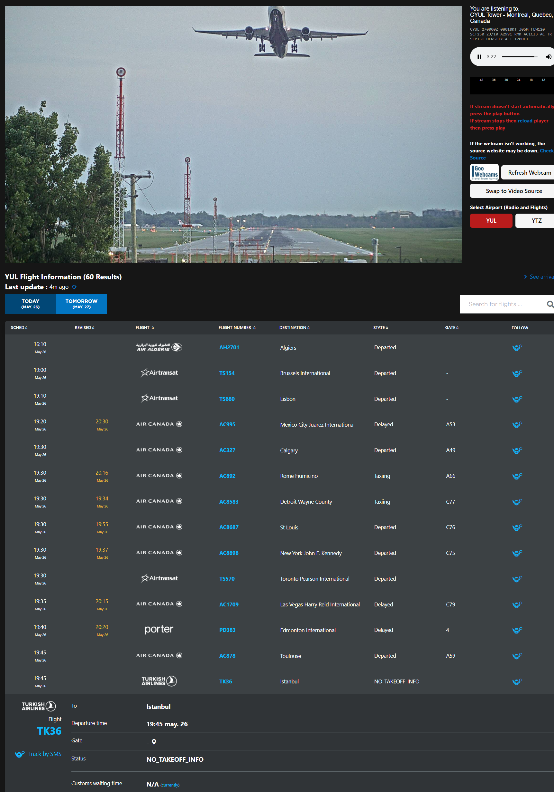

# AirportWebcam
Combined Webcam, Radio and Arrival/Departures board for YUL ✈

### Sources
🛫 - Flight Information : skyscanner.ca

📷 - Webcam : goowebcams.com

📻 - ATC Radio : liveatc.net

### Demo

Screenshot of the current webpage on Desktop.

!
!

||
|:-:|
|Dark Mode on Desktop|

### Building

To build for deployment:

```bash
npm install
npm run build
```

You can preview the production build with `npm run preview`.

> To deploy your app, you may need to install an [adapter](https://kit.svelte.dev/docs/adapters) for your target environment.
